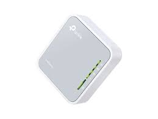
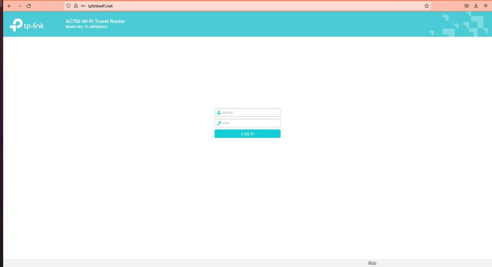
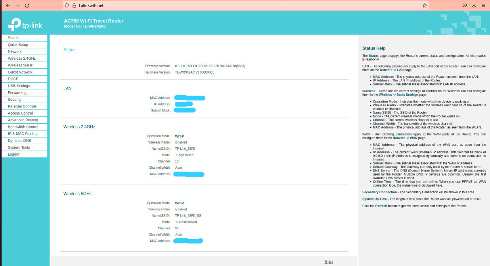
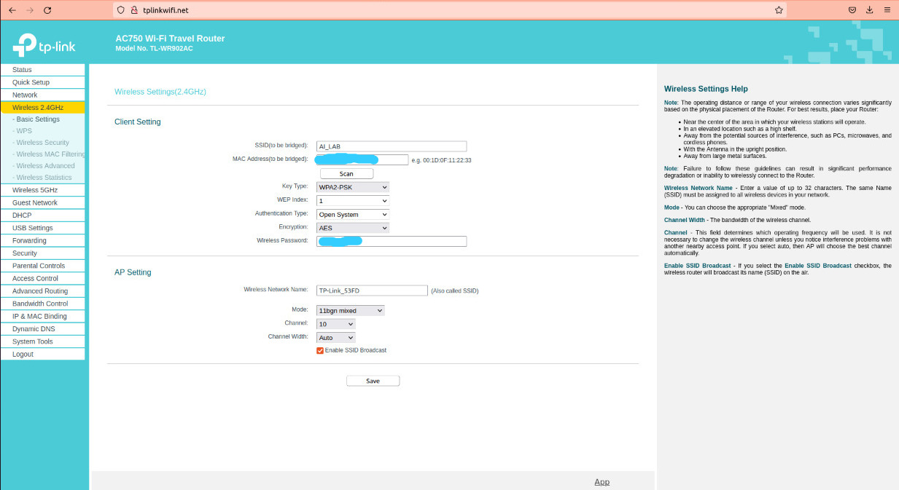

# Repositorio ROVER IA2022B

Este repositorio es presentado por los estudiantes de la asignatura Inteligencia Artificial 2022B de la Universidad de Ibagué. El cual presenta un ROVER el cual se basa en Robotic Operative System ROS y Python para generar su ejecución. 

## Hardware
-   NVIDIA Jetson NANO
-   Pololu Roboclaw
-   Logitech Wireless Gamepad F710
-   Prototipo ROVER.
- 
## Software
- OS Linux 18.04 LTS.
- ROS Melodic.
- Python.

##  Configuración de la Jetson Nano.
- Primero se procede a configurar NVIDIA Jetson NANO, el cual se puede proceder a la guía que facilita la pagina oficial de NVIDIA. 
https://developer.nvidia.com/embedded/learn/get-started-jetson-nano-devkit#write
##  Configuración del Router.
- Primero se debe estar conectado a la red del dispositivo a programar, en nuestro caso contamos con el tplink AC750 WI-FI Travel Router. 


- Luego se debe ingresar a la pagina de tplink, el cual se hace de la siguiente forma:
```http //tplinkwifi.net```

- Al ingresar al link descrito anteriormente les saldrá una pagina el cual les pedirá loguearse, el cual tanto el usuario como la contraseña sera  ```admin```. Como se presentara a continuación.


- Al momento de loguearse, saldra una interfaz como la siguiente:


- Para configurar la red del tplink, se debe presentar la red la cual va a suministrar la red de internet, da 2 opciones, una de ```Wireless Settings(2.4GHz)``` o ```Wireless Settings(5GHz)```. Ya al momento de escoger el Wireless Settings, se pone configura la red la cual va a compartir la internet. En nuestro caso se utilizo ```Wireless Settings(2.4GHz)``` con la red de  ```IA_LAB```


- Para culminar, para guardar la red configurada, se da click en  ```Save``` y esperan un breve momento a que se configure el Router.

## Instalación los repositorios requeridos.

- Instalación del Joy:
Para el nodo de Joy, se instala siguiendo los pasos de Git que dejare a continuación:
https://github.com/MARIOANDRESMEJIA/Joy

- Instalación del Roboclaw:
Para el nodo Roboclaw, se instala siguiendo los pasos del repositorio que se presenta a continuación:
https://github.com/SJulian25/roboclaw_node

- Instalación objectTracker: 
Para el nodo objectTracker, se instala siguiendo los pasos del repositorio que se presenta a continuación:
https://github.com/sarasarixsara/objectTracker


- Instalación del detector de gestos:
Para el nodo detector de gestos, se instala siguiendo los pasos del repositorio que se presenta a continuación:
https://github.com/TWBauer/Funcionalidad-Gestos-rober


## Autores:
Luis Duarte.
Mario Mejia.
Sara Cuy.
Kevin Montaña.
Julian Salgado.

